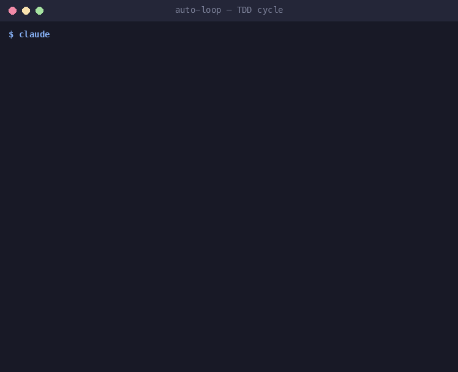

<h1 align="center">Director Mode Lite</h1>

<p align="center">
  <strong>Use Claude Code like a Director, not a Programmer</strong>
</p>

<p align="center">
  <a href="https://github.com/claude-world/director-mode-lite/releases"></a>
  <a href="https://github.com/claude-world/director-mode-lite/stargazers"></a>
  <a href="https://claude.ai/code"></a>
  <a href="https://discord.com/invite/rBtHzSD288"></a>
  <a href="https://opensource.org/licenses/MIT"></a>
</p>

<p align="center">
  <a href="https://claude-world.com/director-mode-lite/">Website</a> |
  <a href="#quick-start">Quick Start</a> |
  <a href="#whats-included">Features</a> |
  <a href="examples/">Examples</a> |
  <a href="https://discord.com/invite/rBtHzSD288">Discord</a>
</p>

---

<p align="center">
  <i>"Don't write code. Direct Claude to write code for you."</i>
</p>

---

## Start Here

After installing, run these 3 commands:

```bash
/getting-started          # Guided 5-minute onboarding
/project-init             # Auto-detect project and configure
/workflow                 # Start your first feature
```

> **New to Director Mode?** Read [What is Director Mode?](#what-is-director-mode) below, or jump to [Quick Start](#quick-start).

<details>
<summary><strong>Compatibility</strong></summary>

Director Mode Lite v1.9.0 is aligned with the Claude 5-era Claude Code specification, including support for:

- **Claude 5 family** model selection in agent/skill frontmatter (`fable`, `opus`, `sonnet`, `haiku` aliases)
- **Agent Teams** (experimental multi-agent collaboration)
- **1M context window** models (`opus[1m]`, `sonnet[1m]`)
- All 30 hook event types including `SessionStart`, `PreCompact`, and `PostCompact`
- **Multi-account delegation** via `CLAUDE_CONFIG_DIR` profiles (`/handoff-claude`)

> Last tested with Claude Code CLI v2.1.201 in July 2026. Newer CLI releases may work, but should be re-verified rather than assumed compatible.

</details>

---

## What is Director Mode?

**Director Mode** is a paradigm shift in AI-assisted development. Instead of writing code line by line, you **direct** Claude to execute your vision autonomously.

```
  Traditional Coding                    Director Mode
  ━━━━━━━━━━━━━━━━━━                    ━━━━━━━━━━━━━━

  You: Write code                       You: Define the vision
  AI:  Follow orders                    AI:  Execute autonomously
       ↓                                     ↓
  Micromanagement                       Strategic oversight
  One task at a time                    Parallel agent execution
  Manual intervention                   Continuous automation
```

### Core Principles

| Principle | Description |
|-----------|-------------|
| **Efficiency First** | Direct execution, minimal interruption |
| **Parallel Processing** | Multiple agents working simultaneously |
| **Autonomous Execution** | AI handles implementation details |
| **Strategic Oversight** | You focus on "what" and "why" |

---

## Key Feature: TDD-Driven Auto-Loop

<table>
<tr>
<td width="50%">

### Test-Driven Development Automation

Similar to [Ralph Wiggum](https://github.com/anthropics/claude-code/tree/main/plugins/ralph-wiggum), **Auto-Loop** uses Stop hooks but focuses on TDD:

- **Acceptance Criteria Tracking** - Parse `- [ ]` and auto-check completion
- **TDD Methodology** - Red-Green-Refactor cycle guidance
- **Checkpoint Recovery** - Resume from `.auto-loop/checkpoint.json`
- **Agent Collaboration** - code-reviewer, test-runner integration

**Stop anytime** with:
```bash
touch .auto-loop/stop
```

</td>
<td width="50%">

```
/auto-loop "Create a calculator

Acceptance Criteria:
- [ ] add(a, b) function
- [ ] subtract(a, b) function
- [ ] Unit tests"

[Iteration 1] RED    → Write test...
[Iteration 2] GREEN  → Implement...
[Iteration 3] REFACTOR → Clean...
[Iteration 4] GREEN  → subtract()...
[Iteration 5] All criteria complete!
```

</td>
</tr>
</table>

<p align="center">
  
</p>

---

## Self-Evolving Loop

<table>
<tr>
<td width="50%">

### Beyond Auto-Loop: Strategy Evolution

**Self-Evolving Loop** takes automation further by:

- **Dynamic Skill Generation** - Creates custom skills for each task
- **Learning from Failures** - Extracts patterns and root causes
- **Strategy Evolution** - Improves its own execution approach
- **8-Phase Workflow** - ANALYZE → GENERATE → EXECUTE → VALIDATE → DECIDE → LEARN → EVOLVE → SHIP

**Key difference from auto-loop:**
| Feature | auto-loop | evolving-loop |
|---------|-----------|---------------|
| Strategy | Fixed TDD | Dynamic |
| Learning | None | Extracts patterns |
| Adaptation | Low | High |

</td>
<td width="50%">

```bash
/evolving-loop "Build REST API

Acceptance Criteria:
- [ ] GET /users endpoint
- [ ] POST /users endpoint
- [ ] Input validation
- [ ] Error handling
"

# The loop:
# 1. Analyzes requirements deeply
# 2. Generates custom executor skill
# 3. Executes with TDD
# 4. Validates results
# 5. If fails: learns & evolves skills
# 6. Repeats until all criteria pass
# 7. Ships the final result
```

**Check status:**
```bash
/evolving-status
/evolving-status --history
/evolving-status --evolution
```

</td>
</tr>
</table>

See [`docs/SELF-EVOLVING-LOOP.md`](docs/SELF-EVOLVING-LOOP.md) for complete documentation.

---

## Quick Start

### Option A: Native Plugin

```bash
# 1. Register the third-party marketplace (once per Claude profile)
claude plugin marketplace add claude-world/director-mode-lite

# 2. Install the marketplace-qualified plugin
claude plugin install director-mode-lite@director-mode-lite

# 3. Inside Claude Code, load the newly installed plugin without restarting
/reload-plugins
```

This portable path exposes namespaced skills and agents. It does **not** attach
Auto-Loop, changelog, or validation hooks to the current project. Choose the
clone path below when you want project-local assets and opt-in hooks; do not
script against Claude Code's internal, versioned plugin-cache layout.

<details>
<summary><strong>🔧 Plugin Management Commands</strong></summary>

```bash
# Update plugin to latest version
claude plugin marketplace update director-mode-lite
claude plugin uninstall director-mode-lite@director-mode-lite
claude plugin install director-mode-lite@director-mode-lite

# Load plugin changes in an active Claude Code session
/reload-plugins
```

</details>

### Option B: Project-Integrated Install

```bash
git clone https://github.com/claude-world/director-mode-lite.git
cd director-mode-lite
# Answer a few questions and pick the project's automation level:
./install.sh /path/to/your/project --wizard
# ...or accept the non-interactive defaults:
./install.sh /path/to/your/project
# Verify the project you configured:
./scripts/verify-install.sh /path/to/your/project
```

### Option C: Try Demo First

```bash
git clone https://github.com/claude-world/director-mode-lite.git
cd director-mode-lite
./demo.sh ~/director-mode-demo
```

`demo.sh` uses a throwaway directory, not an operating-system sandbox. If the
target already exists, the script can offer to delete and recreate it; inspect
the path carefully before confirming.

## Verify Installation

Run the verifier against the project where you installed Director Mode Lite:

```bash
# From the cloned checkout used for project integration
./scripts/verify-install.sh /path/to/your/project

# If the wizard intentionally selected no hooks
./scripts/verify-install.sh --allow-no-hooks /path/to/your/project
```

The script checks:

- `python3` and `jq` are available for settings and hook state handling
- `CLAUDE.md` exists; an existing project's custom structure is accepted
- The complete shipped inventory is present: 32 skills, including 27
  user-invocable commands, and 14 agents (additional user assets are allowed)
- Core and Evolving-Loop hook scripts exist and are executable
- `.claude/settings.local.json` is valid JSON and contains at least one
  registered Director Mode hook

It prints colored `PASS` and `FAIL` lines, exits `0` when all checks pass, and exits `1` if any check fails.

If you deliberately selected a completely hook-free wizard setup, pass
`--allow-no-hooks`. It still verifies `CLAUDE.md` and the complete skill/agent
inventory, while skipping hook files, hook dependencies, settings, and
registration checks that do not apply to that mode.

The verifier validates installation structure and configuration. It does not
launch Claude Code, invoke a slash command, run your project tests, or prove
that model-maintained acceptance criteria and outputs are correct.

<details>
<summary><strong>✨ Installation Features</strong></summary>

- **Setup Wizard** - `--wizard` asks about your project and lets you pick which Stop-hook automation (none / Auto-Loop / Auto-Loop + Evolving-Loop) and safety/observability hooks to enable, instead of the fixed defaults
- **Automatic Backup** - Backups existing `.claude/` to `.claude-backup-TIMESTAMP/`
- **Portable Path Hooks** - All hooks use `$CLAUDE_PROJECT_DIR` for portability (no more "file not found" errors)
- **Settings Preservation** - Preserves existing settings; the verifier reports when no Director Mode hook was registered
- **Skip Existing** - Won't overwrite already-installed commands/agents/skills
- **In-Place Upgrade** - `--update` overwrites distributed files with the latest version
- **Scoped Uninstall** - hooks-only removes Director Mode hook files and registrations while preserving custom hooks and runtime state; complete removal is intentionally broader
- **Automated Tests** - `./tests/run-tests.sh` validates installation

</details>

---

## What's Included

<table>
<tr>
<td valign="top" width="33%">

### Commands (27)

**Workflow:**
| Command | Purpose |
|---------|---------|
| `/workflow` | 5-step dev flow |
| `/focus-problem` | Problem analysis |
| `/test-first` | TDD cycle |
| `/smart-commit` | Auto commits |
| `/plan` | Task breakdown |
| `/auto-loop` | **TDD loop** |
| `/evolving-loop` | **Self-evolving** |
| `/evolving-status` | Loop status |

**Setup & Health:**
| Command | Purpose |
|---------|---------|
| `/getting-started` | **5-min onboarding** |
| `/project-init` | Quick setup |
| `/check-environment` | Env check |
| `/project-health-check` | 7-point audit |

**Validators:**
| Command | Purpose |
|---------|---------|
| `/claude-md-check` | Validate CLAUDE.md |
| `/mcp-check` | Validate MCP config |
| `/agent-check` | Validate agent files |
| `/skill-check` | Validate skill files |
| `/hooks-check` | Validate hooks |

**Generators:**
| Command | Purpose |
|---------|---------|
| `/claude-md-template` | Generate CLAUDE.md |
| `/agent-template` | Generate agents |
| `/skill-template` | Generate skills |
| `/hook-template` | Generate hooks |

**Utilities:**
| Command | Purpose |
|---------|---------|
| `/changelog` | Session events |
| `/handoff-codex` | Delegate to Codex |
| `/handoff-gemini` | Delegate to Gemini |
| `/handoff-claude` | **Multi-account Claude** |
| `/agents` | List agents |
| `/skills` | List skills |

</td>
<td valign="top" width="33%">

### Agents (14)

**Core Agents:**
| Agent | Purpose |
|-------|---------|
| `code-reviewer` | Quality, security |
| `debugger` | Error analysis |
| `doc-writer` | Documentation |

**Expert Agents:**
| Agent | Purpose |
|-------|---------|
| `claude-md-expert` | CLAUDE.md design |
| `mcp-expert` | MCP configuration |
| `agents-expert` | Custom agents |
| `skills-expert` | Custom skills |
| `hooks-expert` | Automation hooks |

**Self-Evolving Agents:**
| Agent | Purpose |
|-------|---------|
| `evolving-orchestrator` | Loop coordination |
| `requirement-analyzer` | Deep analysis |
| `skill-synthesizer` | Generate skills |
| `completion-judge` | Decision making |
| `experience-extractor` | Learn from failures |
| `skill-evolver` | Evolve strategy |

</td>
<td valign="top" width="34%">

### Skills (32)

27 of the skills are the slash commands listed left. The other 5 are internal knowledge bases, auto-loaded by agents or triggered by Claude:

| Internal Skill | Purpose |
|-------|---------|
| `code-reviewer` | Review checklists |
| `debugger` | 5-step method |
| `doc-writer` | Doc templates |
| `test-runner` | Test commands |
| `interop-router` | Auto CLI routing |

**Plus:**
- CLAUDE.md template
- Starter hooks (Auto-Loop, changelog, validator)
- 4 hands-on examples

</td>
</tr>
</table>

---

## The 5-Step Workflow

```
┌─────────────────────────────────────────────────────────────────┐
│                                                                 │
│    Step 1                Step 2                Step 3           │
│  ┌─────────┐           ┌─────────┐           ┌─────────┐        │
│  │ FOCUS   │    ──►    │ PREVENT │    ──►    │  TEST   │        │
│  │ PROBLEM │           │ OVERDEV │           │  FIRST  │        │
│  └─────────┘           └─────────┘           └─────────┘        │
│       │                     │                     │             │
│  Understand             Only build            Red-Green-        │
│  before coding          what's needed         Refactor          │
│                                                                 │
│                    Step 4                Step 5                 │
│                  ┌─────────┐           ┌─────────┐              │
│           ──►    │DOCUMENT │    ──►    │ COMMIT  │              │
│                  └─────────┘           └─────────┘              │
│                       │                     │                   │
│                  Auto-generated         Conventional            │
│                  documentation          Commits                 │
│                                                                 │
└─────────────────────────────────────────────────────────────────┘
```

---

## Parallel Agent Execution

One of Director Mode's key advantages is **parallel processing**:

<table>
<tr>
<td width="50%">

### Traditional (Sequential)

```
Agent 1 ─────►
              Agent 2 ─────►
                            Agent 3 ─────►
                                          Agent 4 ─────►

Total time: 4 × single_agent_time
```

</td>
<td width="50%">

### Director Mode (Parallel)

```
Agent 1 ─────┐
Agent 2 ─────┼────► Results
Agent 3 ─────┤
Agent 4 ─────┘

Total time: max(single_agent_time)
```

</td>
</tr>
</table>

### Example: Problem Analysis

```bash
# Old way: Sequential manual searches
grep -r "authentication" src/
grep -r "login" src/
cat src/auth/index.ts
# ... slow, tedious

# Director Mode: One command, 5 parallel agents
/focus-problem "understand the authentication flow"
```

### Scale Out: Multi-Account Delegation

Parallelism doesn't stop at one account. `/handoff-claude` delegates tasks to **other authorized Claude Code instances** — each with its own login, quota, and session state via `CLAUDE_CONFIG_DIR` profiles:

```bash
# One-time setup per profile (isolated login, sessions, settings)
CLAUDE_CONFIG_DIR=~/.claude-profiles/z-1 claude auth login

# Fan out to two accounts in parallel, conflict-free via git worktrees
(cd ../proj-task-a && claude-z-1 -p "Implement feature A" --permission-mode acceptEdits) &
(cd ../proj-task-b && claude-z-2 -p "Implement feature B" --permission-mode acceptEdits) &
wait
```

Run `/handoff-claude` for the full setup guide (wrapper commands, auth, result collection).

---

## Agents

<table>
<tr>
<td width="33%">

### `code-reviewer`

Automatically reviews:
- Code quality
- Security vulnerabilities
- Error handling
- Performance
- Test coverage

**Triggers:** Code changes, commits, "review"

</td>
<td width="33%">

### `debugger`

5-step debugging:
1. Capture error info
2. Isolate problem
3. Form hypotheses
4. Investigate
5. Fix & verify

**Triggers:** Errors, test failures, "bug"

</td>
<td width="34%">

### `doc-writer`

Creates and maintains:
- README files
- API documentation
- Code comments
- Architecture docs

**Triggers:** New features, structure changes

</td>
</tr>
</table>

---

## Expert Agents

Director Mode Lite includes **5 Expert Agents** that deeply understand Claude Code's official features:

<table>
<tr>
<td width="20%">

### `claude-md-expert`

Your guide for:
- CLAUDE.md design patterns
- Project configuration
- Best practices

**Ask:** "How should I structure my CLAUDE.md?"

</td>
<td width="20%">

### `mcp-expert`

Your guide for:
- MCP server setup
- Available MCPs
- Troubleshooting

**Ask:** "How do I add a Notion MCP?"

</td>
<td width="20%">

### `agents-expert`

Your guide for:
- Custom agent creation
- Tool permissions
- Agent patterns

**Ask:** "Create a security-reviewer agent"

</td>
<td width="20%">

### `skills-expert`

Your guide for:
- Slash command creation
- Skill frontmatter
- Workflow design

**Ask:** "Make a /deploy command"

</td>
<td width="20%">

### `hooks-expert`

Your guide for:
- Stop hooks (Auto-Loop)
- PreToolUse/PostToolUse
- Automation patterns

**Ask:** "How do I protect .env files?"

</td>
</tr>
</table>

> **Why?** Anthropic provides documentation, but no specialized helpers. These experts know the official docs and help you implement correctly.

---

## Validators & Generators

Pair with Expert Agents for **validate-then-fix** or **template-then-customize** workflows:

<table>
<tr>
<td width="50%">

### Validators (5)

Validate your configurations and get actionable fix suggestions:

```bash
/claude-md-check              # Check CLAUDE.md structure
/mcp-check                    # Check MCP settings.json
/agent-check [file.md]        # Check agent file format
/skill-check [file.md]        # Check skill file format
/hooks-check                  # Check hooks config + scripts
```

**Output format:**
```markdown
## Validation Report

### Status: ✅ PASS / ⚠️ WARNINGS / ❌ FAIL

| Check | Status | Notes |
|-------|--------|-------|
| ...   | ✅/❌  | ...   |

### Issues Found
1. [Issue and recommendation]

### Auto-Fix Available
- Run command X to fix...
```

</td>
<td width="50%">

### Generators (4)

Generate properly-formatted files from templates:

```bash
/claude-md-template           # Generate CLAUDE.md
/agent-template [name] [purpose]  # Generate agent
/skill-template [name] [purpose]  # Generate skill
/hook-template [type] [purpose]   # Generate hook
```

**Example:**
```bash
/agent-template security-scanner "scan for vulnerabilities"

# Creates: .claude/agents/security-scanner.md
# with proper frontmatter, activation triggers,
# output format, and guidelines
```

**Hook types:**
- `PreToolUse` - Block/validate before tool runs
- `PostToolUse` - Log/react after tool runs
- `Stop` - Continue automation loops
- `Notification` - External alerts (Slack, etc.)

</td>
</tr>
</table>

---

## CLAUDE.md Configuration

The `CLAUDE.md` file configures Claude's behavior in your project:

```markdown
# Project: My App
Tech: TypeScript, React, PostgreSQL

# Policies
- Always write tests first
- Use conventional commits
- Document public APIs

# Workflow
- Parallel agents: enabled
- Auto-commit: disabled
- Review before merge: required
```

See [`docs/CLAUDE-TEMPLATE.md`](docs/CLAUDE-TEMPLATE.md) for a complete template.

---

## Comparison

<table>
<tr>
<th></th>
<th>Traditional AI Coding</th>
<th>Director Mode Lite</th>
</tr>
<tr>
<td><strong>Workflow</strong></td>
<td>Ask → Wait → Copy → Test → Repeat</td>
<td>Direct → Auto-execute → Review</td>
</tr>
<tr>
<td><strong>Parallelism</strong></td>
<td>One task at a time</td>
<td>Multiple agents simultaneously</td>
</tr>
<tr>
<td><strong>Automation</strong></td>
<td>Manual intervention needed</td>
<td>Auto-Loop runs until done</td>
</tr>
<tr>
<td><strong>Testing</strong></td>
<td>Often forgotten</td>
<td>TDD built into workflow</td>
</tr>
<tr>
<td><strong>Documentation</strong></td>
<td>Afterthought</td>
<td>Auto-generated</td>
</tr>
</table>

---

## Examples

Learn by doing with hands-on tutorials:

| Example | Description | Time |
|---------|-------------|------|
| [Calculator](examples/01-calculator/) | Auto-Loop TDD demo | 5 min |
| [REST API](examples/02-rest-api/) | Building an API with TDD | 15 min |
| [CLI Tool](examples/03-cli-tool/) | Command-line tool | 10 min |
| [TypeScript Library](examples/04-library/) | Publishable npm library | 20 min |

See [examples/](examples/) for full tutorials.

---

## Community

<table>
<tr>
<td align="center" width="25%">
  <a href="https://claude-world.com/director-mode-lite/">
<strong>🌐 Website</strong><br>
claude-world.com
</a>
</td>
<td align="center" width="25%">
<a href="https://discord.com/invite/rBtHzSD288">
<strong>💬 Discord</strong><br>
Join the community
</a>
</td>
<td align="center" width="25%">
<a href="https://claude-world.com/stats">
<strong>📊 Live Stats</strong><br>
Traffic & community growth
</a>
</td>
<td align="center" width="25%">
<a href="https://github.com/claude-world/director-mode-lite/issues">
<strong>🐛 Issues</strong><br>
Report bugs, request features
</a>
</td>
</tr>
</table>

---

## Documentation

| Document | Description |
|----------|-------------|
| [FAQ](docs/FAQ.md) | Common questions answered |
| [Concepts](docs/DIRECTOR-MODE-CONCEPTS.md) | Deep dive into methodology |
| [CLAUDE.md Template](docs/CLAUDE-TEMPLATE.md) | Project configuration guide |
| [Hooks Guide](docs/HOOKS-GUIDE.md) | Hook implementation reference (30 event types) |
| [Self-Evolving Loop](docs/SELF-EVOLVING-LOOP.md) | Dynamic skill evolution system |
| [Development Patterns](docs/DEVELOPMENT-PATTERNS.md) | Learned best practices |

---

## Related Projects

Other open-source tools from the Claude World community:

| Project | Description | Link |
|---------|-------------|------|
| **cf-browser** | Cloudflare Browser MCP server for headless browsing, screenshots, and web scraping within Claude Code | [github.com/anthropic-community/cf-browser](https://github.com/anthropic-community/cf-browser) |
| **trend-pulse** | Real-time trend aggregation MCP server -- monitors 8+ sources (GitHub, Hacker News, Reddit, etc.) for content ideas | [github.com/anthropic-community/trend-pulse](https://github.com/anthropic-community/trend-pulse) |

> These tools work great alongside Director Mode Lite. Use `cf-browser` for web research agents and `trend-pulse` for staying on top of developer trends.

---

## Author

**Lucas Wang** ([@lukashanren1](https://x.com/lukashanren1))

- GitHub: [@gn00295120](https://github.com/gn00295120)
- Product page: [claude-world.com/director-mode-lite](https://claude-world.com/director-mode-lite/)

---

## License

MIT License - Free for personal and commercial use.

See [LICENSE](LICENSE) for details.

---

## About Director Mode Lite

This is a **free, open-source toolkit** (v1.9.0) from the [Claude World](https://claude-world.com) community, last tested with Claude Code CLI v2.1.201.

<table>
<tr>
<td width="50%">

**What's included (FREE):**
- 27 Commands (incl. validators & generators)
- 14 Agents (3 Core + 5 Experts + 6 Self-Evolving)
- 32 Skills
- Auto-Loop with TDD
- Expert-guided project setup
- Validation & template generation
- Complete documentation

</td>
<td width="50%">

**Want more?**

Visit [claude-world.com](https://claude-world.com) for:
- Advanced methodologies
- Enterprise support
- Full Director Mode experience

</td>
</tr>
</table>

---

<p align="center">
  <a href="https://claude-world.com">Website</a> |
  <a href="https://discord.com/invite/rBtHzSD288">Discord</a> |
  <a href="https://x.com/lukashanren1">Twitter</a>
</p>

<p align="center">
  <sub>Made with direction by Claude World Taiwan</sub>
</p>
